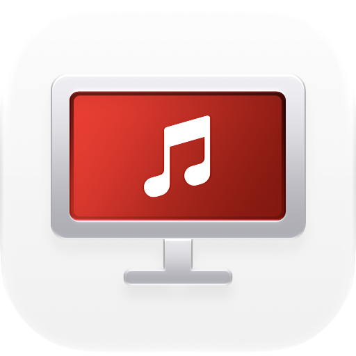

# AudioPaper



> Your desktop, set to the music you're playing.

[](./LICENSE)
[](https://developer.apple.com/swiftui/)
[](https://www.apple.com/macos)
[](https://github.com/msitarzewski/AudioPaper/actions/workflows/ci.yml)
[](https://github.com/sponsors/msitarzewski)

AudioPaper is a small app for macOS 26 that changes your wallpaper whenever the song changes. It puts the album cover up straight away, then cross-fades in fan art and artist photos while the song plays, like a Photos-folder wallpaper slideshow. It lives in the menu bar, with a Liquid Glass Mini Player and desktop widgets when you want more. It's native, with no third-party dependencies, no accounts and no telemetry.

## How it works

1. **Hears the track change.** Apple Music posts a system notification on every change, so there's no polling and no special permission. On launch, AudioPaper asks Music once what's already playing.
2. **Shows the album cover.** It's looked up online, at up to 3000×3000, from the Apple Music catalog, then MusicBrainz / Cover Art Archive, and finally the artwork Music itself has. The cover sits centered over a blurred, colour-matched wash of itself.
3. **Cross-fades in fan art and artist photos.** It asks fanart.tv (fan-made 1080p and 4K artist backgrounds), TheAudioDB (curated artist backgrounds, no key needed), Wikimedia Commons (freely licensed photos, credited to the photographer) and DeviantArt first. Brave Image Search fills in only when fewer than three images pass the filters, which saves its quota for artists the others don't cover.

   Each artist builds a pool of up to 24 images as you play their songs (each song is searched once), and every play shows the ones you've seen least recently, so favourites stay fresh without extra network use.

   Artists are identified through MusicBrainz using the song itself, so namesakes aren't confused (ROSÉ of BLACKPINK is not Rose, the French singer), and art is fetched by that ID rather than by name. Collaborations ("LE SSERAFIM & j-hope", "feat.") get art of each credited artist.

   Results are filtered on your Mac with Apple's Vision framework (after skipping anything smaller than 1280×720):
   - rejects screenshots and documents (Vision's "utility" image check)
   - rejects images with prominent text (titles, lyric cards, logos, UI), while allowing small incidental text like shirt numbers
   - rejects screens, ads, print, product shots and other scenes that aren't art or photography
   - drops duplicates of the cover, of what's on screen, and of each other, but keeps different photos from the same shoot
   - ranks what's left by Vision's aesthetics score, with a boost for images it classifies as artwork

   Survivors fill the screen edge to edge. If filling would crop too much (portrait images, for example), the whole image is fitted instead, with its edges feathered into a blurred extension of itself.

   Credits name the artist and where the image came from; for web results that's the artist the image was matched to plus the site, since wallpaper sites' page titles rarely say who's pictured.
4. **Rotates like a slideshow.** A new image fades in every 45 seconds (you can change this). The fade is drawn in a click-through window just above the desktop, and then the real wallpaper is set underneath. So the picture stays after you quit, and it shows up in Mission Control on every Space and every display.

## Where it lives

- **Menu bar:** a standard macOS menu, per Apple's guidelines. It shows the track, credits the art (with a link to the artist's profile and the page it came from), and has Next Image, Pause, Restore Original Wallpaper, Show Mini Player (⌥⌘M), Settings… and Quit. You can hide the menu bar icon in Settings.
- **Mini Player:** a small window modelled on Music's MiniPlayer, with the artwork under the window controls and a Liquid Glass background that takes on the colours of your wallpaper. It shows the credit, a strip of every image in rotation (the one on screen stays highlighted and in view), and the controls. From its **…** button it can *Float on Top* and *Show on All Desktops*. It reopens at launch if you left it open, in the same spot.
- **Widgets:** *Now Playing* (small, medium, large), with working Pause and Next Image buttons on medium and large, and *Artwork* (every size), which shows the current wallpaper image with its credit. Clicking a widget opens the Mini Player. Like every macOS widget, they turn grayscale while the desktop isn't focused (with the *Automatic* widget style). Add them with **Edit Widgets** on the desktop (AudioPaper must be installed in `/Applications` for them to appear).
- **Dock:** AudioPaper stays out of the Dock unless the Mini Player is open or the menu bar icon is hidden, so there's always a way back in. Clicking the Dock icon opens the Mini Player, and right-clicking it shows the wallpaper actions.

## Requirements

- macOS 26 (Tahoe) or later
- Apple Music (more players are planned; see [Roadmap](#roadmap))
- Fan art works out of the box via TheAudioDB's free public key. For more and better images, add a [fanart.tv](https://fanart.tv) API key, and for artists those don't cover, a [Brave Search API](https://api-dashboard.search.brave.com/) key and/or a [DeviantArt application](https://www.deviantart.com/developers/) (client ID + secret), all in Settings → Accounts.

## Build and run

```sh
brew install xcodegen
git clone https://github.com/msitarzewski/AudioPaper
cd AudioPaper
xcodegen generate
open AudioPaper.xcodeproj
```

Run the **AudioPaper** scheme. It appears in the menu bar rather than the Dock. Add API keys in **Settings → Accounts**; they're stored in your Keychain.

To use the widgets, install it to `/Applications` (the widget gallery only lists installed apps): `scripts/install.sh`.

Building from the command line, or without an Apple Developer team:

```sh
xcodebuild -project AudioPaper.xcodeproj -scheme AudioPaper -derivedDataPath build CODE_SIGNING_ALLOWED=NO build
```

## Settings

| Setting | Default | What it does |
|---|---|---|
| Wallpaper | Album cover, then fan art | Or album cover only |
| Fan art framing | Automatic | Fill the screen, fit the whole image, or decide per image (fits when filling would crop more than 15%) |
| Change fan art every | 45 s | 15 s – 5 min |
| Show in menu bar | On | When off, AudioPaper appears in the Dock instead |
| Restore my wallpaper when music stops | Off | Puts your own wallpaper back 30 s after playback stops |
| Storage: keep up to | 500 MB | 250 MB – 2 GB of downloaded artwork; least-recently-used images go first. **Clear Cache…** empties it, keeping what's on screen |
| Open at login | Off | Uses `SMAppService` |
| Players / Fan art sources | All available | Turn each plugin on or off; new sources start on |

Settings reopens on the tab you used last.

## Privacy

The full account is in **[PRIVACY.md](./PRIVACY.md)** (who learns what, what's stored) and **[NETWORK.md](./NETWORK.md)** (every host, request and timing). In brief:

- No telemetry, analytics, accounts or AudioPaper server.
- Searches send only the **artist, album and song names** to the lookup services listed below. Nothing else about you or your library leaves your Mac.
- Requests use a private network session: no cookies, no web cache. Replays and repeat artists are answered from the cache.
- All image filtering (text, screenshots, duplicates, aesthetics) runs **on your Mac** with Vision.
- API keys live in your **Keychain**.
- The widgets read a small snapshot (the track, credits and thumbnails) that the app writes to its own App Group container. It never leaves your Mac.
- Downloaded images are cached in `~/Library/Containers/com.audiopaper/Data/Library/Caches/AudioPaper`, up to the limit you choose in Settings (500 MB by default).

## Data sources

AudioPaper uses these services. Each image shown in the app credits its source and links back to it.

| Source | Used for | Key |
|---|---|---|
| [iTunes Search API](https://performance-partners.apple.com/search-api) | Album covers | None |
| [MusicBrainz](https://musicbrainz.org) + [Cover Art Archive](https://coverartarchive.org) | Album covers when Apple's catalog doesn't know the release; artist identity (by song) for fanart.tv and TheAudioDB | None |
| Music app | Last-resort cover for the track that's playing | None |
| [fanart.tv](https://fanart.tv) | Fan-made artist backgrounds (1920×1080 and 4K), by MusicBrainz ID | A project key, plus your optional personal key |
| [Wikimedia Commons](https://commons.wikimedia.org) (via [Wikidata](https://www.wikidata.org)) | Freely licensed artist photos, credited with photographer and license | None |
| [TheAudioDB](https://www.theaudiodb.com) | Artist backgrounds (fan art and photos, 1280×720) | Free public key built in; optional personal key |
| [DeviantArt API](https://www.deviantart.com/developers/) | Fan art, with artist profile links | Your own app credentials |
| [Brave Search API](https://brave.com/search/api/) | Fan art and artist photos when the sources above come up short | Your own key (the free tier is 2,000 queries/month; AudioPaper caches results and spaces requests to stay within it) |

Fan art belongs to the people who made it. AudioPaper shows it on your own desktop with credit, and never saves it anywhere else or shares it.

## Architecture

```
App/                          SwiftUI app: menu bar menu, Mini Player window, Settings, Dock behaviour,
                              AppIcon.icon and the menu bar template icons
Widgets/                      WidgetKit extension (Now Playing, Artwork); reads the App Group snapshot
Packages/AudioPaperKit/       Everything else, as a Swift package
  Sources/AudioPaperKit/
    Sources/                  NowPlayingSource plugins (Apple Music)
    Artwork/                  AlbumArtworkProvider plugins + chain
    FanArt/                   FanArtSource plugins, Vision ArtworkFilters, FanArtPipeline
    Wallpaper/                Core Image composer, NSWorkspace wallpaper service + cross-fade
    Cache/                    Downloaded artwork and remembered search results (LRU, size-limited)
    Support/                  MusicBrainz identity, preferences, Keychain, widget snapshot, HTTP
    NowPlayingCoordinator     Playback events → cover → fan art → rotation
  Sources/apctl/              Developer CLI: cover, fanart, labels, render
docs/icon/                    App icon SVG masters and the palette build (build_icons.py)
scripts/install.sh            Build, install to /Applications and relaunch (needed for widgets)
project.yml                   XcodeGen project spec (the .xcodeproj is generated)
```

Players, cover providers, fan-art sources and image filters are all **plugins**, each a small Swift protocol. Adding one is a single file plus one line of registration; see [CONTRIBUTING.md](./CONTRIBUTING.md#adding-a-plugin).

The interface follows Apple's Human Interface Guidelines for macOS: a menu (not a popover) in the menu bar, a Music-style Mini Player, settings panes that size to their content, and a layered vector app icon built in Icon Composer: a sibling of GlassPowerTools' display, with a music note on the screen (`docs/icon/README.md`).

## Roadmap

- More players: Spotify first (it posts the same kind of change notification Music does)
- More art sources: Deezer
- A paid TheAudioDB key would be needed before any Mac App Store release (their free key excludes app stores)
- Smarter logo detection (stylized band logos can slip past text recognition)

## Support

AudioPaper is free and MIT-licensed. If it makes your desk nicer, you can [sponsor its development on GitHub](https://github.com/sponsors/msitarzewski).

## License

[MIT](./LICENSE) © 2026 Michael Sitarzewski. The icon's musical note is from Heroicons (MIT); see [THIRD-PARTY-NOTICES.md](./THIRD-PARTY-NOTICES.md).
